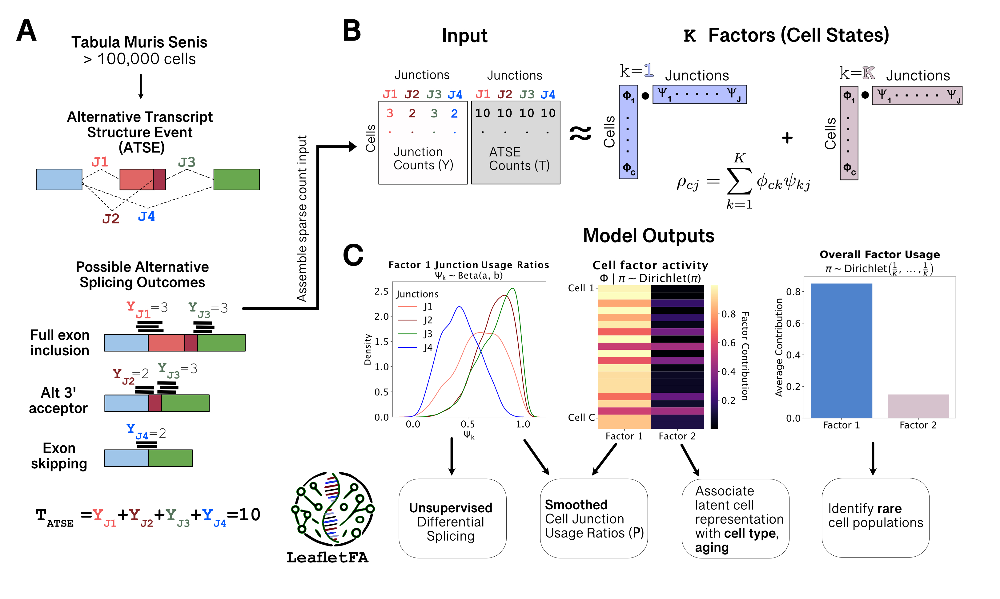

# LeafletFA - A probabilistic factor model for learning RNA splicing-driven cell states in single-cell RNA-seq data
LeafletFA leverages probabilistic Bayesian inference to identify alternative splicing patterns that define distinct cellular states in large-scale single-cell datasets. The model uniquely learns cell-specific splicing states without relying on predefined splicing events or cell-type labels, making it ideal for exploring complex splicing dynamics.

### Model overview 
The figure below provides a visual summary of the LeafletFA model and its input data structure:

### Key Features
1. **Obtain smoothed junction usage ratio values** for individual cells.
2. **Associate latent cell-factor activities** with biological features such as age, cell type, or any other annotation of interest.
3. **Perform unsupervised differential splicing analysis** to discover novel splicing patterns across diverse cell states.

### Getting Started
A detailed tutorial on running and customizing LeafletFA is coming soon!

### Model Details: LeafletFA Beta-Dirichlet Factorization
LeafletFA models the observed junction read counts, $y_{cj}$, conditional on the total ATSE read counts, $T_{cj}$, for each cell $c$ and junction $j$. Each cell is represented as a weighted combination of latent factors, where each factor has an estimated usage ratio for each junction. This factorization is expressed as:

$$
\mathbb{E}\left[\frac{y_{cj}}{T_{cj}}\right] = \rho_{cj} = \sum_{k=1}^K \phi_{ck} \psi_{kj}.
$$

The parameters of this model are:

- **$\phi$**: Represents each cell's composition across the latent factors.
- **$\psi$**: Usage ratio for each junction within each factor.
- **$\pi$**: Defines how much each factor contributes to the entire population of cells.

### Contact
If you have any questions, please feel free to [submit an issue](https://github.com/daklab/LeafletFA/issues) or email me at `kisaev[@]nygc.org`.
