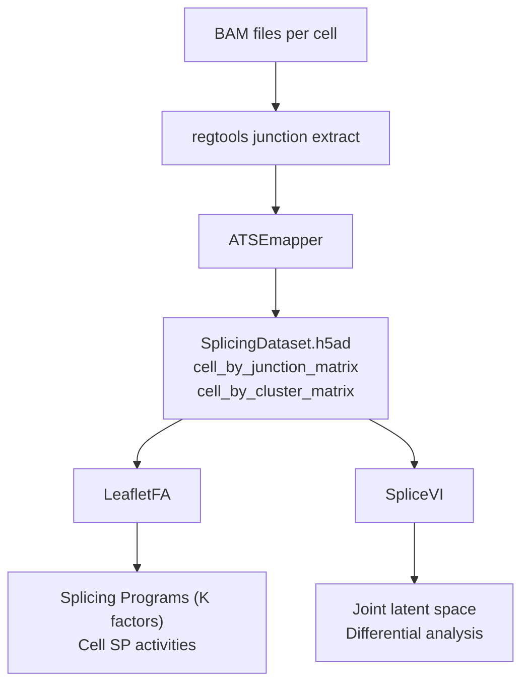

# LeafletFA

LeafletFA is a scalable probabilistic Beta-Dirichlet factor model that decomposes single-cell splicing variation into interpretable **Splicing Programs (SPs)**. It discovers coordinated modules of Alternative Transcript Structure Events (ATSEs) that reflect biological states — cellular aging, lineage, stress — without requiring pre-defined labels.

## Ecosystem overview

Three tools form the splicing analysis ecosystem. They share a common intermediate format, **SplicingDataset**, so you can swap models without reformatting data.



| Tool | Role | Repo |
|------|------|------|
| **ATSEmapper** | BAM files → SplicingDataset | [daklab/ATSEmapper](https://github.com/daklab/ATSEmapper) |
| **LeafletFA** | Beta-Dirichlet factor model | [daklab/LeafletFA](https://github.com/daklab/LeafletFA) |
| **SpliceVI** | Multimodal VAE (splicing + expression) | [daklab/SpliceVI](https://github.com/daklab/SpliceVI) |

ATSEmapper is the bridge between the bulk-sequencing infrastructure most labs already run and the single-cell-native format both LeafletFA and SpliceVI consume.

## Quick install

```bash
git clone https://github.com/daklab/LeafletFA.git
cd LeafletFA
pip install -e .
```

## Minimal example

```python
import anndata as ad
from leafletfa import LeafletFA

adata = ad.read_h5ad("splicing_dataset.h5ad")

model = LeafletFA(adata, K=20)
model.from_anndata()   # validate input and build tensors
model.train()          # variational inference
model.get_all_variables()

model.psi          # (K × junctions) — splicing program loadings
model.assign_post  # (cells × K)     — cell factor activities
model.pi           # (K,)            — factor prevalences
```

See [LeafletFA model](models/leafletfa.md) for the full parameter reference and [SplicingDataset format](data-layer/splicingdataset.md) for the expected input structure.
